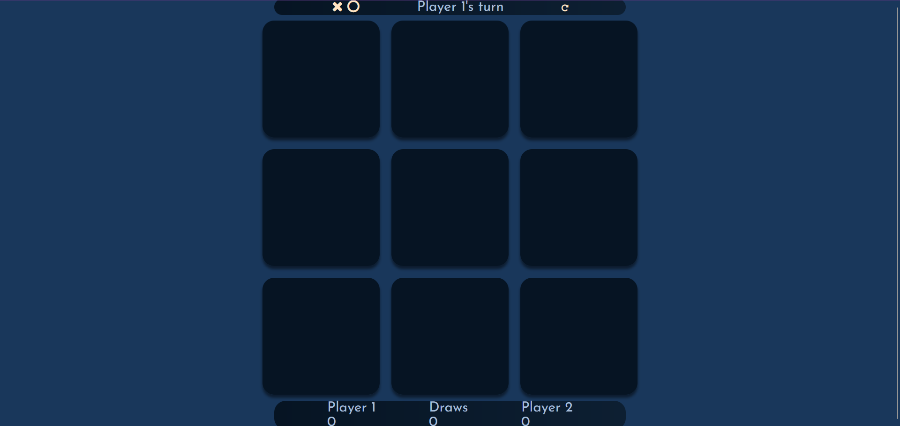
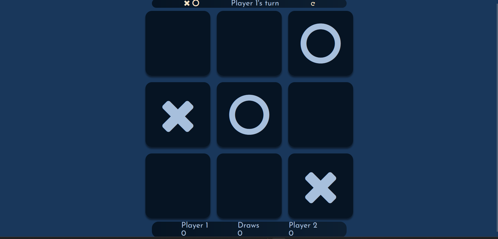
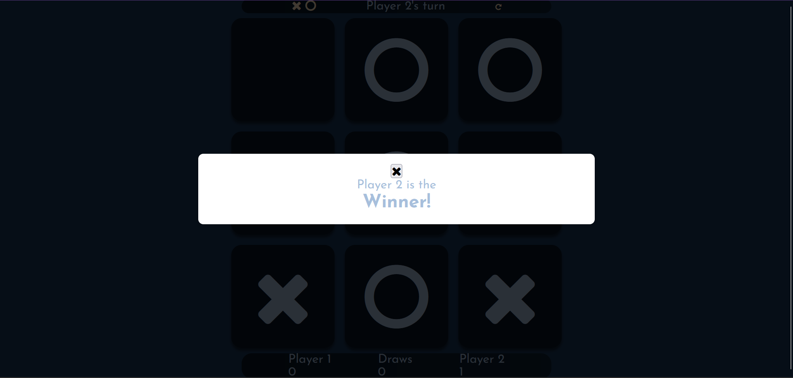

# Devoir2_3540_300261356
#LOUCIF MOHAMED DJAHID / 300261356
# Tic Tac Toe Game

This is a classic Tic Tac Toe game built with HTML, CSS, and JavaScript.

## How to Play

- The game is played on a grid that's 3 squares by 3 squares.
- Player 1 is X, and Player 2 is O. Players take turns putting their marks in empty squares.
- The first player to get 3 of their marks in a row (up, down, across, or diagonally) is the winner.
- When all 9 squares are full, the game is over. If no player has 3 marks in a row, the game ends in a draw.

## Game UI States

*Game start screen.*

*Gameplay in action.*

*Announcing the results.*

## Design System

Please refer to the [Design System Documentation](design_system.md) for detailed information on the design aspects of the Tic Tac Toe game.

## Technical Summary

For a technical overview of the game's implementation, visit the [projects section](#) of my portfolio.

